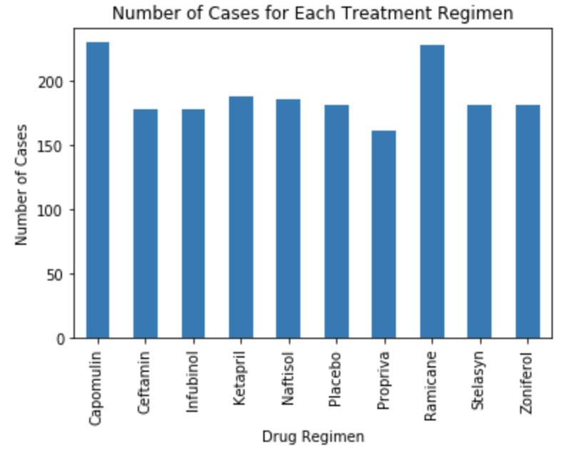
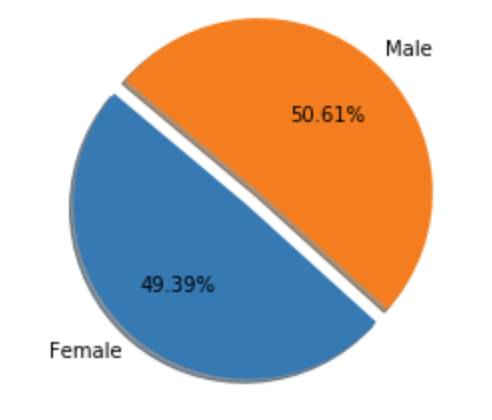
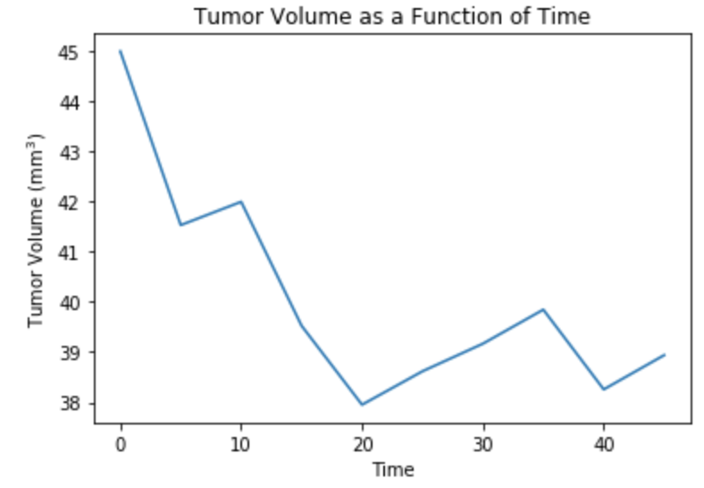
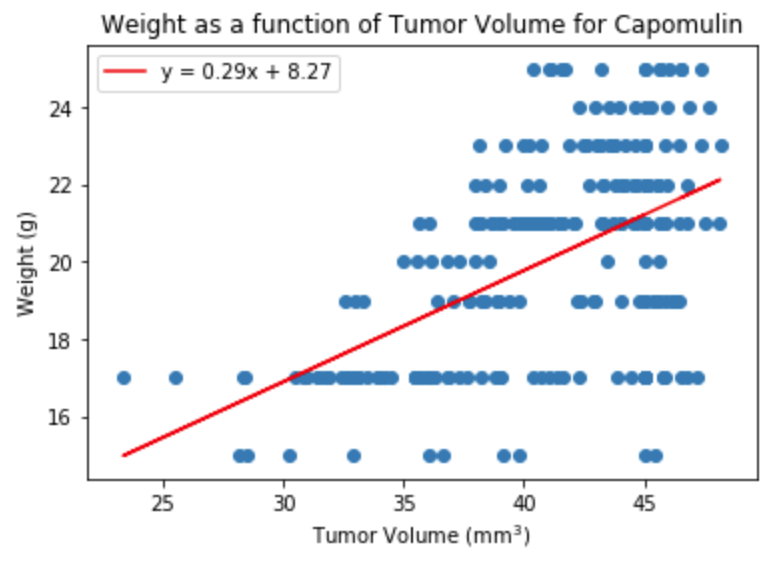

# Analysis of tumor growth in mice

Using plots nalysis using the data of 259 mice with SCC tumor growth, who were treted using various drug regimes and find out what was the most reliable drug, or how the tumor growth is related to the size and weigth of each mouse.

## Built with

* Matplotlib
* Pandas
* Scipy

